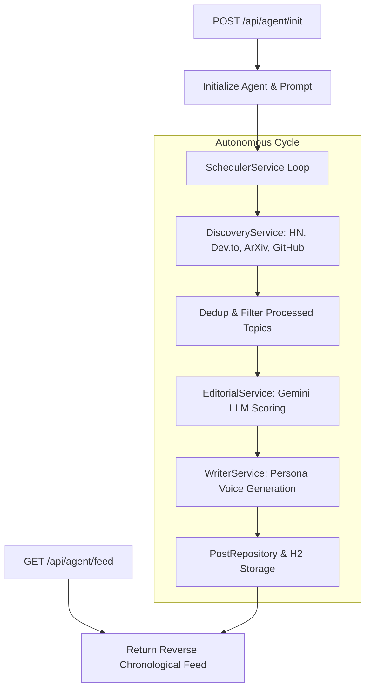

# ☕ Autonomous AI Persona Agent (Java + Spring Boot 3)

An enterprise-grade, autonomous AI agent backend built with **Java 21** and **Spring Boot 3** that independently discovers, curates, and publishes AI & technology content — no human intervention needed after initialization.

> Built for hackathon evaluation: the agent runs continuously for 48+ hours, discovering topics from live sources (Hacker News, ArXiv, Dev.to, GitHub), applying LLM editorial judgment via Google Gemini, and publishing in a consistent persona voice.

---

## 🏗️ Architecture Diagram



---

## ⚡ Tech Stack

- **Language**: Java 21 LTS
- **Framework**: Spring Boot 3.4.5 (Spring MVC, Spring Data JPA, Scheduled Execution)
- **Database**: H2 Persistent File Database (`./data/persona`)
- **LLM Engine**: Google Gemini API (`gemini-2.0-flash`) via `RestClient`
- **Build Tool**: Apache Maven (Wrapper included: `mvnw` / `mvnw.cmd`)

---

## 🚀 Quick Start (Run Locally)

### Step 1: Set your Gemini API Key

**In Command Prompt (cmd):**
```cmd
set GEMINI_API_KEY=your_gemini_api_key_here
```

**In PowerShell:**
```powershell
$env:GEMINI_API_KEY="your_gemini_api_key_here"
```

### Step 2: Start the Spring Boot App

```powershell
cd C:\Users\aryan\.gemini\antigravity\scratch\autonomous-ai-persona
.\mvnw.cmd spring-boot:run
```

### Step 3: Initialize the Agent

```powershell
$body = '{"persona": {"name": "Ada", "domain": "AI Security"}}'
$response = Invoke-RestMethod -Method POST -Uri "http://localhost:3000/api/agent/init" -ContentType "application/json" -Body $body
Write-Host "Your Agent ID: $($response.agentId)"
```

---

## 📡 Checking the Feed

```powershell
Invoke-RestMethod -Uri "http://localhost:3000/api/agent/feed?agentId=YOUR_AGENT_ID" | ConvertTo-Json -Depth 5
```
